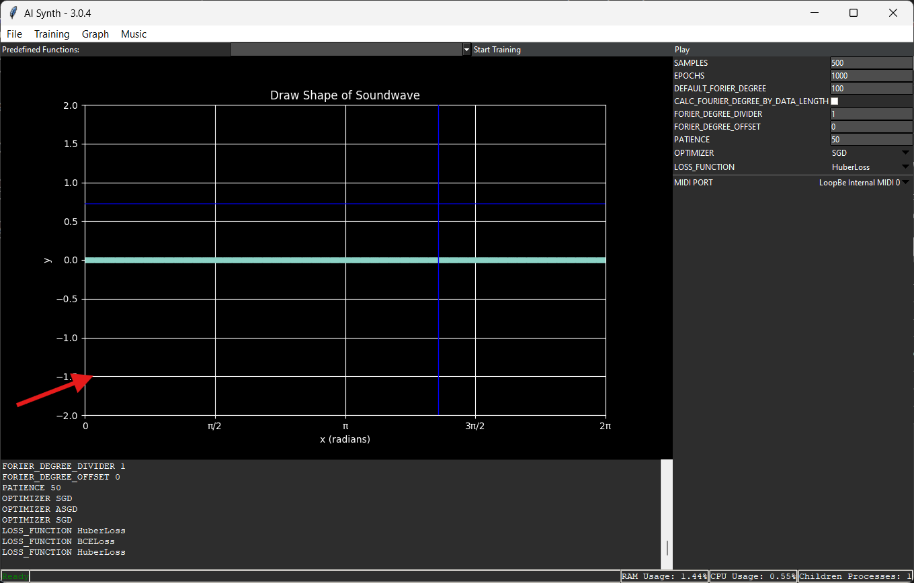
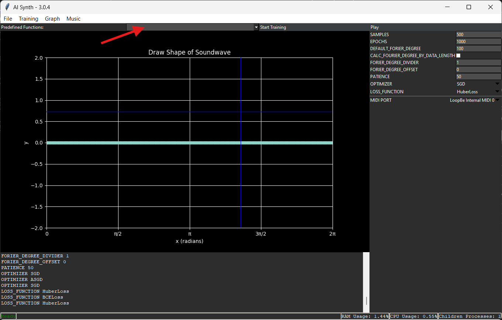
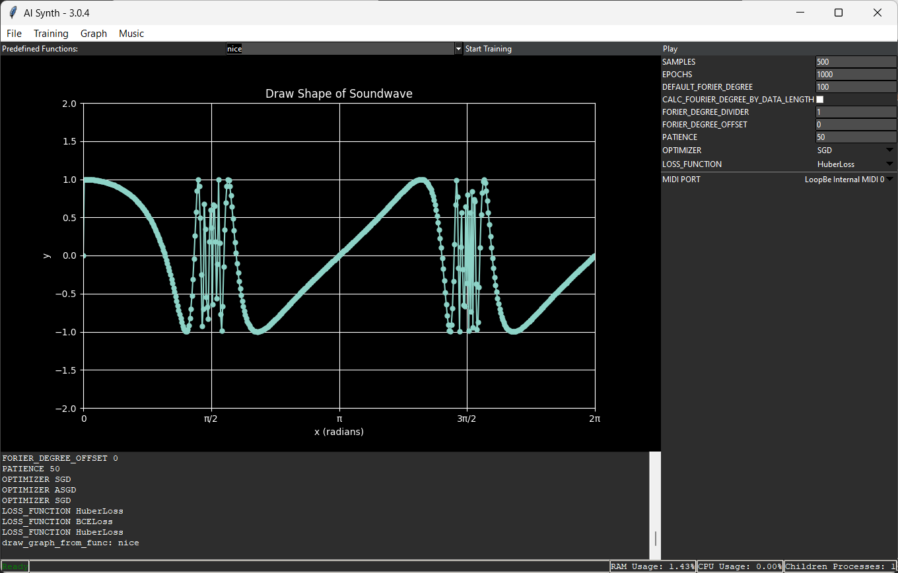
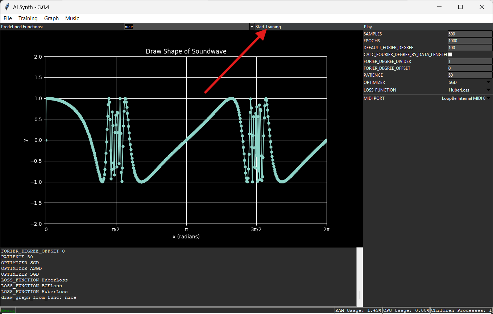
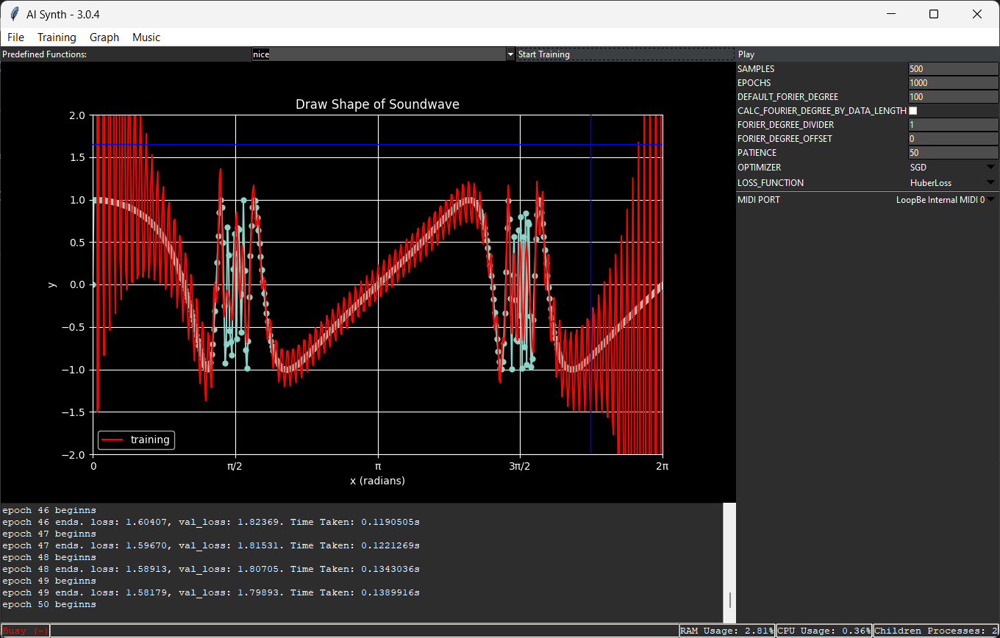

# Basics

## Soundwave

### Drawing

You can draw the Shape of the Soundwave inside the big Plot.
The Dots are the individual points of the Line you draw.

### Predefined Functions

There are already some Waveforms predefined.
You can select them in the Select Box labeled **Predefined Functions**

> This is one of the predefined functions, its called **nice**, cause i find it sounds nice and i had no better name, if you have a
> problem with this, find a better name!

## Training

Once you have drawn the Shape of the Soundwave you Start the trainings Process by Clicking on the **Start Training** Button.

The Trainings Process gets initialized and after some time a Red Line appears in the Plot, this it the current output of the model.

## Making Music

To make Music using this Synth, you need to have a valid Midi Input Port.
You can select a Midi Port at the Select Box labeld **MIDI PORT**.

As soon as the the training Process finishes and you selected the right Midi Port you can start the Synth by pressing the Play Button.

Once the synth is ready you hear a Sound. Now you can use it.

## Midi piano

In case you have no midi piano or similar device that can send Midi Signals to the Synth we included a simple Piano programm where you can select a Midi Port and play musik with it.