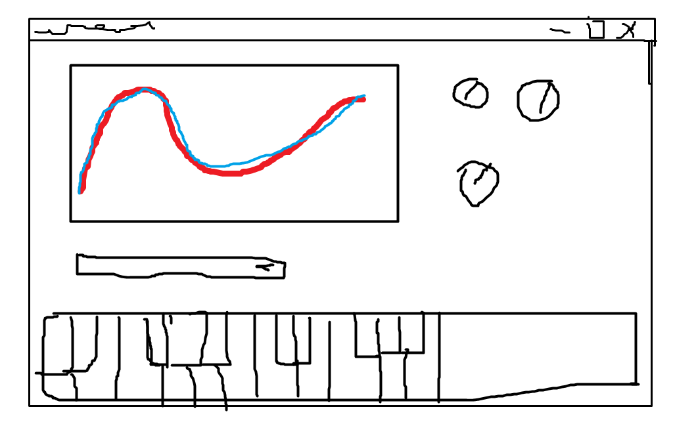

# My Idea about this programm

> This was my Plan at the Beginning

I want to create a Python-Application where you draw a function and a neural-net tries to aproximate it to make sound from it.

## GUI Desing

My idea is that you have a Canvas containing the graph you can draw and any time you change it the neural net gets updated. there should also be a way to play some notes. I also want some Controll dials like Volume, base frequenzy, or something like an Equalizer.

## Backend

i want to use a simple neural net getting trained to aproximate a drawn function. the app also has a midi input and a audio output.

### Training Data

the data is generated by spliting the draing in the canvas to single points.

The amount of samples in the training data should be able to be way lower than the sample rate at the end, this could be either archive via this:
$newpoint=\frac{(old\_point_1+old\_point_2)}{2}$ or by duplicating points and adding a random small amount to $x$ and $y$ of the new point.

## Future Plans for My Synth Project

Here are some enhancements I'm considering for my synth project:

1. **Frequency to MIDI Mapping**: I'm thinking of mapping the dominant frequency of my model to a MIDI note. This could result in cleaner sounds, as MIDI notes correspond to specific frequencies.

2. **Modulation**: I plan to create interesting effects by modulating my sound with other signals. For example, I could use a low-frequency oscillator (LFO) to modulate the amplitude, frequency, or phase of my sound, creating effects like tremolo, vibrato, or phasing.

3. **Effects Processing**: I'm considering adding audio effects like reverb, delay, distortion, or chorus to enhance the sound of my synth. I would implement these effects using digital signal processing (DSP) techniques.

4. **Envelope Shaping**: To give me more control over the temporal evolution of my sound and make it more expressive, I'm planning to implement an ADSR (Attack, Decay, Sustain, Release) envelope.

I'm excited about these enhancements and looking forward to implementing them in my project!
