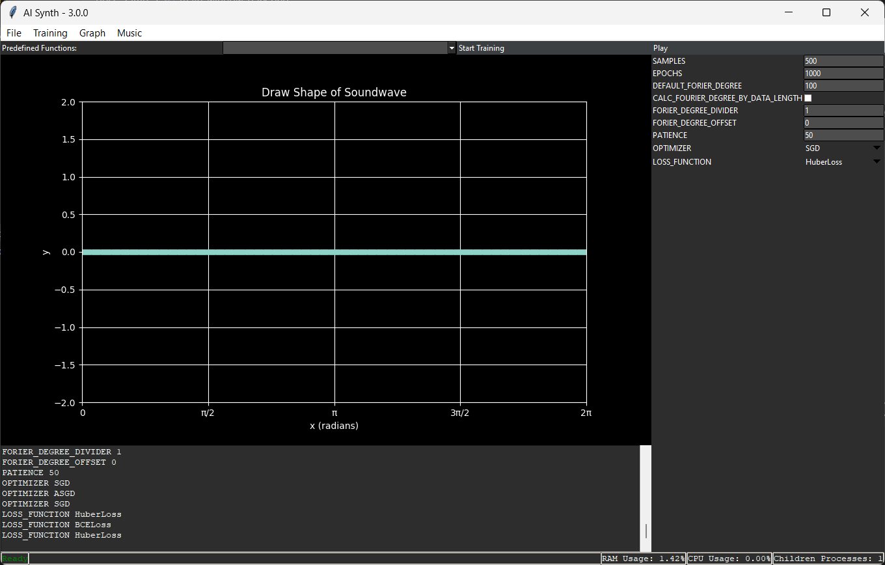

# PythonAISynth

> Documentation is not complete (99.99% incomplete).
> maybe you should write the Documentation.

This is how The App Looks

## General

PythonAISynth is a software designed to create music using a Regression Model. The Model is based on the concept of Fourier Series. it is used to approximate a curve on a Plot that a user can draw. the model is then used to generate sound with higher sample rate than the drawing.
